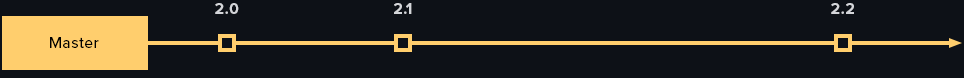
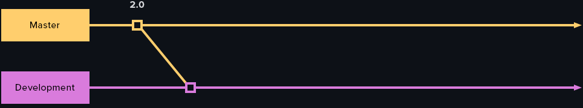
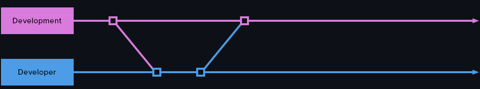
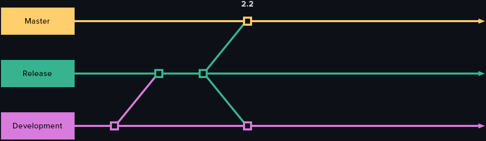
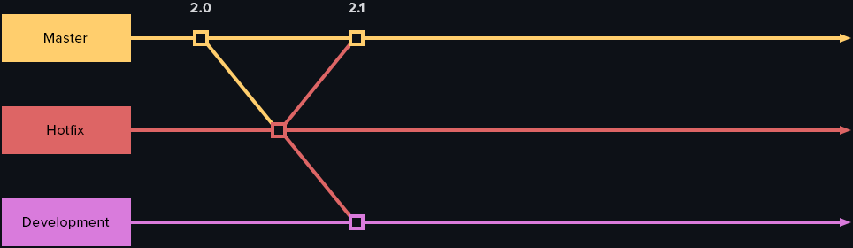
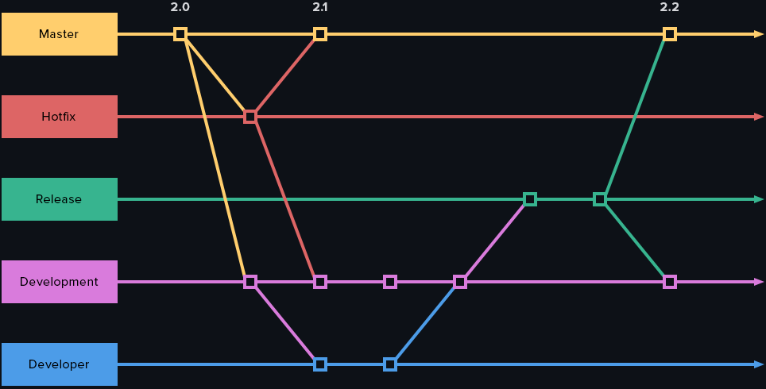

 
 
 

 
 
 

# Github Branches Workflow

 

Github branches workflow for **version control** of Glide projects. 

This document explains what is the purpose of each branch type and why and how to use it in development workflow.

This document also deals with all rules that have to be followed when working with different types of branches in Github.

 
 

| #  | Topics |
|----|-------|
| 01 | [Master Branch](https://github.com/abubakar-me/glide-design/tree/master/github-branches-workflow#1%EF%B8%8F%E2%83%A3---master-branch) |
| 02 | [Development Branch](https://github.com/abubakar-me/glide-design/tree/master/github-branches-workflow#2%EF%B8%8F%E2%83%A3---development-branch) |
| 03 | [Developer Branch](https://github.com/abubakar-me/glide-design/tree/master/github-branches-workflow#3%EF%B8%8F%E2%83%A3---developer-branch) |
| 04 | [Release Branch](https://github.com/abubakar-me/glide-design/tree/master/github-branches-workflow#4%EF%B8%8F%E2%83%A3---release-branch) |
| 05 | [Hotfix Branch](https://github.com/abubakar-me/glide-design/tree/master/github-branches-workflow#5%EF%B8%8F%E2%83%A3---hotfix-branch) |
| 06 | [Big Picture](https://github.com/abubakar-me/glide-design/tree/master/github-branches-workflow#6%EF%B8%8F%E2%83%A3---big-picture) |

 
 
 
 

## 1️⃣ - Master Branch

 

> ✔️ `Master branch` will always have final code

 

- This is main branch of the project repository

- Whenever this is updated, that is tagged as a new version release

- On update code is automatically deployed to `development environment`

- In emergency situation only `hotfix branches` will be created from this branch to make emergency code edits

 

 
 
 
 

## 2️⃣ - Development Branch

 

> ✔️ `Development branch` will always have latest code

 

- This is active development branch of the project repository

- All developers will create there own `developer branches` from this branch for any type of code edits

- This will branch out of `master branch` after initial project setup

- `Release branches` will be created from this branch to release new theme versions

 

 
 
 
 

## 3️⃣ - Developer Branch

 

> ✔️ `Developer branch` will always belong to only one developer

 

- This is developer specific branch

- This will branch out of `development branch`

- And merge back into `development branch` when that developer is done with edits

- `Developer branch` will get deleted once that is no longer required

 

#### 👉 For Example 

We have 5 new tickets, developer will create a `developer branch` and work on those 5 tickets in his branch. And when he is done, he will merge back into `development branch`.

 

 
 
 
 

## 4️⃣ - Release Branch

 

> ✔️ `Release branch` will always be attached to a new version release

 

- This will branch out of `development branch`

- And after testing and version update it will merge into `master branch`

- `Master branch` will be tagged with a new version number upon merge

- `Release branch` will merge back into `development branch` so that the `development branch`can stay as latest working copy

- `Release branch` will be kept for additional record

 

#### 👉 For Example 

We are ready for a new version release, we will create a `release branch` and update version number in this branch. Next, we will merge `release branch` into `master branch` and tag it with new version number. And lastly we will merge `release branch` into `development branch` to keep it as latest working copy.

 

 
 
 
 

## 5️⃣ - Hotfix Branch

 

> ✔️ `Hotfix branch` will always be attached to an emergency code edit

 

- This will branch out of `master branch` on an emergency basis

- And after fixing and testing it will merge back into `master branch`

- `Master branch` will be tagged with a new version number upon merge

- `Hotfix branch` will merge back into `development branch` so that the `development branch`can stay as latest working copy

- `Hotfix branch` will get deleted once that is no longer required

 

#### 👉 For Example 

We have an emergency situation and we need to make quick fix, we will create a `hotfix branch` and update code in this branch. Next, we will merge `hotfix branch` into `master branch` and tag it with new version number. And lastly we will merge `hotfix branch` into `development branch` to keep it as latest working copy.

 

 
 
 
 

## 6️⃣ - Big Picture

 

Lets put up everything in one big picture to visualize how the workflow wroks.

 
 

 
 

⚠️ Its critical that all developers on all teams follow these guidelines rules to ensure effective version control of Glide projects.

 
 
 

Happy Coding!

 

**Prepared by:**
Muhammad AbuBakar

 
 
