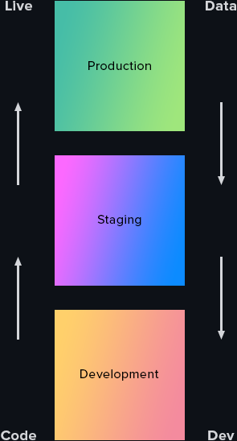

 
 
 

 
 
 

# WP Engine Environments Workflow

 

WP Engine environemts workflow for **version control** of Glide projects. 

This document explains what is the purpose of each environment type and why and how to use it in development workflow.

This document also deals with all rules that have to be followed when working with different types of environments in WP Engine account.

 
 

| #  | Topics |
|----|-------|
| 01 | [Production Environment](https://github.com/abubakar-me/glide-design/tree/master/wpengine-environments-workflow#1%EF%B8%8F%E2%83%A3---production-environment) |
| 02 | [Staging Environment](https://github.com/abubakar-me/glide-design/tree/master/wpengine-environments-workflow#2%EF%B8%8F%E2%83%A3---staging-environment) |
| 03 | [Development Environment](https://github.com/abubakar-me/glide-design/tree/master/wpengine-environments-workflow#3%EF%B8%8F%E2%83%A3---development-environment) |
| 04 | [Golden Rule](https://github.com/abubakar-me/glide-design/tree/master/wpengine-environments-workflow#4%EF%B8%8F%E2%83%A3---golden-rule----code-moves-up--data-moves-down) |

 
 
 
 

## 1️⃣ - Production Environment

 

> ✔️ This is live website, this is only meant for public view

 

- This will always have 100% final, tested and approved code and data

- Never ever make an edit to code on live website

 
 
 
 

## 2️⃣ - Staging Environment

 

> ✔️ This is staging website to review changes and updates, this is meant for reviewers and content editors

 

- `Staging environment` will serve as bridge between `development environment` and `production environment`

- Whenever we need to do new set of updates we can copy data from `production environment`

- When updates are done, Code will be pushed from `development environment` to `staging environment`

- When this is ready to go live we can push code to `production environment`

- Staging data will never get pushed upwards to `production environment`, only if we are going live for first time

 
 
 
 

## 3️⃣ - Development Environment

 

> ✔️ This is development website to develop new code, this is meant for developers only

 

- Whenever we need to do new set of updates we can copy data from `staging environment`

- When this is ready we can push code to `staging environment`

- Development data will never get pushed upwards to `staging environment`, only if we are going live for first time

 
 
 
 

## 4️⃣ - Golden Rule - 🔺 Code Moves Up 🔻 Data Moves Down

 

The `top` layer is `production environment` that is live website for public view.

The `middle` layer is `staging environment` that serves as bridge between other two.

The `bottom` layer is `development environment` where we are developing the website.

 
 

 
 

The code will always move upwards from `development` to `staging` to `production environment`.

The database will always move downwards from `production` to `staging` to `development environment`.

Staging environment will always serve as bridge between the other two environments and all reviewing and testing will be done on staging environmnt.

**✅ Never move database upwards from staging to production to avoid mishaps.**

 
 

Happy Coding!

 

**Prepared by:**
Muhammad AbuBakar

 
 
